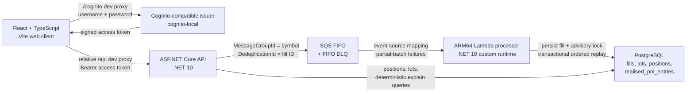

# Trade Ledger

> **Work in progress:** this repository is an actively developed portfolio project. The backend, FIFO accounting domain, asynchronous processor, local infrastructure, AWS reference architecture, and first React client are in place. The browser client now covers local sign-in, positions, fill acceptance, open lots, and deterministic ledger explanations; production web hosting and real Ollama-backed narration are not implemented. See [Current status](#current-status) for the exact boundary.

Trade Ledger accepts executed trade fills, maintains long-only positions, and calculates realised profit and loss using first-in, first-out (FIFO) lot matching. It is built to demonstrate production-minded C#, event-driven processing, relational persistence, infrastructure as code, and explicit engineering trade-offs in a system that can be inspected and run locally.

**FIFO means two things here, and both matter.** SQS FIFO ordering keeps messages for one market symbol in sequence. FIFO lot matching consumes the oldest open position lots first when calculating cost basis. The transport guarantee and the accounting rule reinforce each other, while the processor also replays persisted fills by execution time so accounting does not depend on network arrival order.

## What this project demonstrates

- A pure, deterministic domain model for FIFO lot matching and realised P&L.
- A queue-first asynchronous write path with `202 Accepted`, SQS FIFO, Lambda partial-batch failures, idempotent redelivery, and a dead-letter queue.
- Transactional PostgreSQL ledger rebuilds protected by per-symbol advisory locks.
- ASP.NET Core API design with FluentValidation, Problem Details, Swagger, health checks, correlation IDs, and structured JSON logs.
- Cognito-style JWT authentication that runs entirely offline with one automatically registered local demo user.
- A strict React/TypeScript client with accessible dialogs, generated OpenAPI/TanStack Query bindings, validated forms, deterministic component tests, and a real-stack Playwright critical path.
- Terraform modules for both a working LocalStack loop and a production-shaped AWS reference architecture.
- Unit, hosted API integration, real PostgreSQL/LocalStack end-to-end, and mocked-provider Terraform tests.
- Deliberate restraint: no generic repository, MediatR, CQRS split, AutoMapper, Kubernetes, service mesh, or event-sourcing framework without a problem that earns them.

## Engineering discipline

This is the part of the repository intended for a senior reviewer. The architecture is not being presented as a collection of fashionable project names. Each boundary has a job, the dependencies point inward, and abstractions exist only where they isolate a real source of change.

The evidence below describes code that exists now. A future `OllamaLlmClient` is discussed as an extension point, not claimed as an implemented second provider.

| Principle | Where it is visible in the current code |
| --- | --- |
| Single responsibility | `FifoMatcher` performs deterministic lot matching. `FillRequestService` validates and publishes accepted requests. `FillMessageHandler` coordinates one transactional ledger rebuild. `PositionRepository` reads persisted position state. Controllers and the Lambda entry point only adapt external input. |
| Open/closed | `ExplainService` depends on `ILlmClient`, not a provider. Adding an Ollama implementation would require a new adapter and one composition-root registration; the controller and explanation use case would not change. |
| Substitutability | `ExplainService` is tested through a mocked `ILlmClient`, while the running application uses `InMemoryLlmClient` through the same contract. A future provider must preserve that result and cancellation contract. There is no `OllamaLlmClient` in the repository yet, so the README does not claim that interchange has already been demonstrated between two production providers. |
| Interface segregation | `IFillRequestRepository`, `IPositionRepository`, `IRealisedPnlRepository`, and `IFillLedgerUnitOfWork` expose different operations for different callers. There is no `IRepository<T>` god interface. |
| Dependency inversion | Application defines its persistence and LLM ports. `TradeLedger.Database` implements the persistence ports. Domain depends on no project or external package. |
| Repository pattern | EF Core entities and repository implementations remain internal to `TradeLedger.Database`; application and domain types cross the boundary instead of `DbSet` or `IQueryable`. |
| Controller to service to data | Controllers depend only on application services. The API references `TradeLedger.Database` to register it at the composition root, but repository implementations, EF entities, and `DbSet` accessors are `internal`; controllers cannot directly reference them. |
| Functional core, imperative shell | FIFO arithmetic is pure domain code. HTTP, SQS, Lambda, logging, locking, and PostgreSQL form the I/O shell around it. |
| Unit of work and idempotent consumer | One processor transaction owns the advisory lock, first-seen fill persistence, ordered replay, ledger replacement, processed timestamps, commit, and rollback. Matching redelivery is a no-op; a conflicting duplicate ID is rejected. |

### KISS is demonstrated by what is absent

Six source projects are not the complexity in this system; each has a concrete dependency or deployment boundary. Complexity would be ceremony with no failure mode or change pressure to justify it. This repository therefore leaves out:

| Deliberately absent | Why it is absent |
| --- | --- |
| MediatR | There is no cross-cutting request pipeline that needs independently decorated handlers. Direct application-service calls are easier to follow. |
| A CQRS framework or separate read model | Commands and queries have focused services, but one PostgreSQL model handles both loads at this scale. A second consistency model would add cost without solving a current problem. |
| AutoMapper | The small number of explicit mappings are visible, type checked, and easier to debug than convention-based configuration. |
| A generic repository | Fill acceptance, position queries, realised P&L queries, and transactional replay need different contracts and consistency guarantees. Flattening them into CRUD would hide those differences. |
| Blanket Polly policies | SQS already supplies retry and redelivery semantics for processing. No HTTP model provider exists yet. Timeout and retry policy should be added at the future Ollama adapter, where that failure mode actually exists, rather than wrapped around every dependency. |
| Kubernetes or a service mesh | ECS, Lambda, SQS, and RDS already supply the deployment, scaling, and service boundaries this workload needs. |
| Event sourcing | The `fills` table provides replayable business history, but the application does not need an event store, projections framework, or event-versioning machinery. Ordered replay is implemented directly. |

### Two candidate shared packages, two different extraction rules

Not all shared code should cross a repository boundary for the same reason.

- FIFO/SQS processing mechanics are domain-shaped. `SqsMessageHandler<TMessage>` currently owns FIFO group blocking, partial-batch failure behavior, deserialization, correlation scope, and typed dispatch inside the processor. `processed_at` idempotency remains part of the fill-ledger persistence contract. These should become a published messaging package only when another real consumer, such as the E-commerce project, proves which parts of the interface are genuinely reusable.
- HTTP operational plumbing is different. Exception-to-Problem-Details handling, correlation propagation, and structured logging have little business-domain content and essentially one useful shape. Some primitives already live in `TradeLedger.Common`, while the ASP.NET Core middleware remains in the API. When the E-commerce API needs the same stack, that is enough evidence to extract the shared HTTP package; it does not need the same second-consumer pressure as FIFO accounting behavior.

This is the same interface-segregation rule applied to reuse: do not force transport mechanics, domain idempotency, and HTTP middleware into one package merely because all three can be called “shared.”

## Current status

This table describes the repository at the current commit, not the intended final product.

| Area | State | Evidence in the repository |
| --- | --- | --- |
| FIFO domain model | Implemented and unit tested | `TradeLedger.Domain`, including the `100 @ 10`, `100 @ 12`, sell `150 @ 15` test that produces `650` realised P&L |
| Fill acceptance | Implemented | The API validates a fill, publishes one typed FIFO message, and returns `202 Accepted` only after SQS accepts it |
| Queue processor | Implemented | The Lambda validates and persists first-seen messages, then applies each symbol ledger in the same database transaction; FIFO partial-batch failures and a DLQ handle retries |
| Ordering and idempotency | Implemented and locally integration tested | Execution-time replay, fill-ID tie-breaker, PostgreSQL advisory lock, `processed_at`, and a real LocalStack/Postgres test |
| Position and lot queries | Implemented | REST endpoints backed by EF Core repositories |
| Explain endpoint | Partially implemented | `ILlmClient` isolates the model boundary and `InMemoryLlmClient` produces deterministic repository-backed tool-style answers; it does not call a real model yet |
| Local environment | Implemented for backend, infrastructure, and browser development | Docker Compose runs PostgreSQL, free LocalStack Community, and `cognito-local`; Terraform creates the FIFO queues, Lambda, IAM, logs, and event mapping; Vite runs the React client on the host and proxies only to loopback services |
| AWS architecture | Written and plan tested, never deployed | WAF, HTTPS ALB, private ECS, private Lambda, RDS, SQS/DLQ, network and security-group modules |
| CloudWatch observability | Partially declared, never deployed | Terraform defines a 30-day API log group, a 7-day processor log group, ECS Container Insights, and WAF metrics; there are no alarms, dashboards, metric filters, custom application metrics, or tracing |
| Web client | First production-quality local slice implemented; deployment remains WIP | `web/` contains the React/TypeScript/Vite application, Cognito-local sign-in, positions, accessible Add Fill dialog and lots drawer, Explain flow, generated API client, tests, and CI checks. There is no production hosting configuration. |
| Local LLM | Foundation implemented | The application-owned `ILlmClient` port and deterministic local adapter are in place; Ollama, model tool calling, and provider retry/timeout policy remain planned work |
| Authentication and access model | Implemented for the demo | Protected routes validate locally issued Cognito-compatible access tokens. Bootstrap registers one demo user. Every authenticated user would access the same ledger because tenants, accounts, and row ownership are deliberately outside this demo's scope. |
| Full local main-flow verification | Backend suite runs in CI; browser flow is an explicit local check | The external .NET suite drives the hosted API through real LocalStack SQS/Lambda and PostgreSQL. `web/e2e/trade-ledger.spec.ts` exercises sign-in, asynchronous fill processing, lots, Explain, and logout against that running stack. |

The next product milestone is an Ollama-backed explanation flow that never performs ledger arithmetic itself. The React client and authentication flow are implemented for the local portfolio demo; production web deployment and multi-user data isolation remain outside the current build specification.

## Architecture

### Current runtime



Locally, PostgreSQL, free LocalStack Community, and the open-source `cognito-local` emulator run in Docker. The API runs on the host with `dotnet run`, and the web client runs on the host with Vite. LocalStack runs the packaged Lambda and event-source mapping, while `cognito-local` supplies the user pool, bootstrap-owned registration, login, signing keys, and JWT discovery endpoints. Vite proxies relative `/api` and `/health` requests to the API and `/cognito` requests to the emulator, so local browser development does not require a backend CORS change. Every proxy target and Compose service port is loopback-only. The root `docker-compose.yml` intentionally contains neither the API nor the web client.

The AWS reference uses the same backend boundaries with a public WAF/HTTPS ALB, a private ECS Fargate API, a private processor Lambda, SQS FIFO, and private RDS PostgreSQL. It does not host the web client. It is tested as Terraform configuration but has never been applied to an AWS account. See [`infra/README.md`](infra/README.md) before considering any AWS deployment because the reference stack creates chargeable resources.

### Processing flow

1. `POST /api/fills` validates and normalises a fill.
2. The API publishes one typed SQS message using the normalised symbol as `MessageGroupId` and the fill ID as `MessageDeduplicationId`, then returns `202 Accepted`.
3. The processor revalidates the message and checks that its message group matches the normalised symbol.
4. Inside a database transaction, it constructs the domain fill and takes a transaction-scoped PostgreSQL advisory lock for that symbol.
5. A first-seen fill ID is persisted as pending. An existing ID must match the message exactly; a mismatch fails the record, while an already processed matching fill becomes a no-op.
6. The processor reloads every persisted fill for the symbol ordered by `executed_at`, then fill ID, and deterministically replays the ledger through `FifoMatcher`.
7. It replaces the symbol's open lots and realised P&L entries, updates realised position state, and stamps newly applied fills with `processed_at` in the same commit.
8. A failed SQS record and later records in its FIFO group are reported for retry without failing successful records from other groups.

The queue is the fill-acceptance boundary, so the API does not coordinate a database write with a queue write. Once SQS accepts the message, the processor owns both persistence and ledger application in one PostgreSQL transaction. The replay step is intentional: SQS preserves arrival order within a group, but an earlier-executed fill can still reach the API later. Rebuilding from persisted execution order keeps accounting deterministic in that case.

### Project boundaries

```text
src/
├── TradeLedger.Domain/       Pure entities, value rules and FIFO matching; no dependencies
├── TradeLedger.Common/       Correlation, structured logging and generic SQS adapter
├── TradeLedger.Application/  Use cases, validation, records, persistence ports and LLM port
├── TradeLedger.Database/     EF Core, PostgreSQL schema, repositories, locking and transactions
├── TradeLedger.Api/          HTTP contracts, controllers and middleware
└── TradeLedger.Processor/    Lambda bootstrap, SQS batch adapter and fill-message handler

tests/
├── TradeLedger.UnitTests/         Domain, application, API, database and processor tests
└── TradeLedger.IntegrationTests/  Hosted API tests and opt-in LocalStack/Postgres suite

infra/
├── modules/                 Reusable network, edge, compute, database and queue modules
└── envs/
    ├── local/               LocalStack queue and Lambda processor
    └── aws/                 Never-deployed AWS reference composition

web/
├── openapi/                 Versioned API contract snapshot
├── scripts/                 Local public-config and OpenAPI refresh helpers
└── src/
    ├── api/                 Orval-generated client and handwritten HTTP boundary
    ├── app/                 Providers, routing and shell composition
    ├── components/ui/       Accessible reusable presentation primitives
    └── features/            Authentication, positions, fills and explanations
```

The dependency rules are pragmatic rather than ceremonial:

- `Domain` has no project or package dependencies.
- `Common` owns domain-agnostic correlation, logging, and SQS mechanics.
- `Application` owns orchestration, persistence interfaces, and the `ILlmClient` boundary; it depends on `Domain` plus the `Common` messaging abstraction.
- `Database` implements application-owned persistence boundaries and maps EF entities to domain/application records.
- `Api` and `Processor` are composition roots. They wire dependencies and adapt external input; they do not own FIFO accounting logic.
- `web/src/api/generated` is generated from the checked-in OpenAPI snapshot and is never hand edited. Feature code owns browser orchestration, TanStack Query owns server state, and the HTTP boundary owns bearer attachment, Problem Details normalization, and `401` session clearing.

## Domain rules

- Positions are long-only. A sell cannot exceed the current open quantity.
- Shorts, fees, tax lots, corporate actions, market data, and multi-currency accounting are outside the current scope.
- Symbols are trimmed, upper-cased, limited to 32 characters, and may contain letters, digits, `.`, `-`, `_`, and `/`; the first character must be alphanumeric.
- Quantities and prices must be positive. PostgreSQL stores both as `decimal(28,8)`.
- `Fill` instances can only be created through validated factories; messages loaded by the processor are revalidated before becoming domain values.
- Fill execution timestamps are converted to UTC.
- Ledger order is `executed_at`, then fill ID as a deterministic tie-breaker.
- Realised P&L is stored per sell fill and can be queried for all time or a date period.
- The current explanation text formats money as GBP; the domain does not yet model currency.

### FIFO example

```text
Buy  100 ACME @ 10
Buy  100 ACME @ 12
Sell 150 ACME @ 15

Realised P&L = 100 × (15 - 10) + 50 × (15 - 12) = 650
Open lots     = 50 ACME @ 12
```

This proves that sales consume the oldest lot first rather than applying average-cost accounting.

## API surface

The current scope is one authenticated shared ledger, not a multi-tenant product. Every API route below except `/health` requires a Cognito-compatible access token. Local bootstrap registers one demo user through the Cognito API; there is intentionally no public registration UI, user table, tenant table, or user/ledger foreign key. Authentication proves the identity boundary, token issuance, issuer/signature/lifetime validation, and app-client validation. It does **not** claim per-user data isolation: any authenticated user added to this pool can access the same ledger. Swagger is exposed only in the Development environment.

| Method | Route | Result |
| --- | --- | --- |
| `POST` | `/api/fills` | Validates and queues a fill; returns `202` with its stable fill ID after SQS accepts the message |
| `GET` | `/api/positions` | Returns positions with open quantity, weighted average unit cost, and realised P&L |
| `GET` | `/api/positions/{symbol}/lots` | Returns open lots in FIFO order; returns `404` for a valid but unknown symbol |
| `POST` | `/api/explain` | Returns visible deterministic tool calls and a ledger-derived answer; real LLM narration is not implemented yet |
| `GET` | `/health` | Returns aggregate PostgreSQL health |

Validation and not-found responses use `application/problem+json`. The API accepts or creates an `X-Correlation-Id`, returns it in the response, places it in structured logs, and sends it as an SQS message attribute so one fill can be followed from HTTP request to processor execution.

## Web client and generated API contract

The `web/` application is a focused local portfolio client rather than a copied admin dashboard. React Router composes the sign-in, Positions, and Explain routes; TanStack Query owns server state; React Hook Form and Zod validate interactive input; and Radix Dialog supplies the accessible modal and drawer behavior. Authentication is intentionally narrow: the sign-in form sends email and password to `cognito-local` using `USER_PASSWORD_AUTH`, keeps the returned **access token** in memory or `sessionStorage`, and clears it on logout, expiry, or an API `401`. There is no registration route.

The browser never calculates FIFO lots, average cost, or realised P&L. It renders the API's values and treats fill submission as asynchronous: `POST /api/fills` returning `202 Accepted` means SQS accepted the request, not that PostgreSQL already contains it. The UI says “Accepted” or “Queued,” performs a bounded positions refresh, and offers a manual refresh if no change becomes observable. There is no fill-status endpoint and no optimistic ledger mutation.

The live API contract is snapshotted at `web/openapi/trade-ledger.v1.json`. Orval generates DTOs and TanStack Query clients into `web/src/api/generated`; that directory must not be edited manually. With the API running locally, refresh and verify the generated boundary from the repository root with:

```bash
cd web
npm run api:pull
npm run api:generate
npm run api:check
```

`api:pull` is the intentional contract-update step. `api:check` regenerates from the committed snapshot and fails when the generated client differs from the checked-in result.

## Run locally

### Prerequisites

- Git.
- Docker Engine/Desktop with Docker Compose v2. Docker is required.
- .NET 10 SDK. CI currently pins `10.0.400`.
- Node.js `22.23.2` and npm 10. The Node version is pinned in `web/.nvmrc`; the committed lockfile records the npm dependency graph.
- Terraform. CI currently uses `1.13.5`; the local root requires `>= 1.5.0` and the AWS reference root requires `>= 1.7.0`.
- AWS CLI v2, used only against LocalStack by the local scripts.
- `curl` and `zip`.

The processor package targets `linux-arm64`. The local path has been verified on Apple Silicon. On an x86-64 machine, Docker must support ARM64 emulation for the LocalStack Lambda.

No AWS account, AWS API key, or paid LocalStack licence is required. The local environment uses free LocalStack Community for SQS/Lambda and the separate open-source `cognito-local` container for Cognito-compatible registration and tokens.

### 1. Clone and restore tools

```bash
git clone https://github.com/gareth-britannic/trade-ledger-demo.git
cd trade-ledger-demo
dotnet restore TradeLedger.sln --locked-mode
dotnet tool restore
```

NuGet lock files are committed, so `--locked-mode` makes a local restore use the same dependency graph as CI.

### 2. Start the local stack, API, and web client

From the repository root, use two terminals. Terminal 1 provisions the dependencies, loads the generated Cognito configuration, supplies the queue URL, and runs the API:

```bash
deploy/scripts/bootstrap-all.sh
source .generated/local-cognito.env
export FillQueue__Url="$(terraform -chdir=infra/envs/local output -raw fill_queue_url)"
dotnet run --project src/TradeLedger.Api --launch-profile http
```

Terminal 2 installs the locked frontend dependencies and starts Vite:

```bash
cd web && npm ci && npm run dev
```

`npm run dev` first runs the dev-only public-configuration helper, then starts Vite at <http://127.0.0.1:5173>. Sign in with `demo@trade-ledger.local` and the effective password recorded in `.generated/local-cognito.env`. There is intentionally no registration or password-reset flow. Authentication demonstrates access-token issuance and validation, but every authenticated identity sees the same shared demo ledger; the application is not multitenant.

To verify the emulated queue resources independently after bootstrap, run:

```bash
deploy/scripts/verify-local-sqs.sh
```

The bootstrap script:

1. starts PostgreSQL 16, LocalStack Community, and `cognito-local` with Docker Compose;
2. creates a local user pool and public app client, registers and confirms `demo@trade-ledger.local`, and writes the generated authority, identifiers, and effective local demo password to the ignored `.generated/local-cognito.env` file;
3. applies the EF Core migrations;
4. publishes and zips the self-contained ARM64 processor;
5. runs Terraform against LocalStack to create the FIFO queue, FIFO DLQ, Lambda, IAM/log resources, and event-source mapping.

The local demo email is `demo@trade-ledger.local`. Bootstrap uses `TradeLedgerDemo123!` unless `TRADE_LEDGER_LOCAL_USER_PASSWORD` overrides it, then records the effective password in the ignored generated environment file. These are disposable local-development credentials and must never be reused elsewhere. `get-local-token.sh` and the web sign-in flow perform `USER_PASSWORD_AUTH` against the emulator; there is no application registration screen because bootstrap owns demo-user provisioning. The password is entered by the operator and is never copied into the frontend source or bundle.

LocalStack state is not persisted by Compose. After its container is recreated, Terraform may report that the emulated resources were deleted and create them again. PostgreSQL and Cognito emulator data are stored in the `postgres-data` and `cognito-data` Docker volumes. All three service ports are bound to `127.0.0.1`, so they are not exposed on every host interface.

`.generated/local-cognito.env` contains disposable local emulator configuration, public identifiers, and the effective local demo password. It does not contain an issued access token. The entire `.generated` directory is ignored by Git and must never be served by the web client or committed; rerun `bootstrap-all.sh` to recreate it before using `get-local-token.sh`, starting the API, or configuring the frontend. The frontend's dev-only configuration script reads only the public app-client ID and writes it with the local region to ignored `web/.env.local`; it does not copy the password or the source file.

With both terminals running, open:

- Web client: <http://127.0.0.1:5173>
- Health: <http://localhost:5232/health>
- Swagger UI: <http://localhost:5232/swagger>

Verify health from another terminal:

```bash
curl -fsS http://localhost:5232/health
```

Expected response:

```json
{"status":"healthy"}
```

### 3. Exercise the local main flow from the command line

In another terminal, request an access token for the registered demo user. The helper outputs only the token, making it safe to use in command substitution:

```bash
TOKEN="$(deploy/scripts/get-local-token.sh)"
```

Calling a protected route without that header returns `401`; the token enables the same request:

```bash
curl -i http://localhost:5232/api/positions
curl -fsS -H "Authorization: Bearer $TOKEN" http://localhost:5232/api/positions
```

Post the FIFO example. These IDs are stable, so rerunning the commands is idempotent:

```bash
curl -fsS -X POST http://localhost:5232/api/fills \
  -H "Authorization: Bearer $TOKEN" \
  -H 'Content-Type: application/json' \
  -d '{"fillId":"10000000-0000-0000-0000-000000000001","symbol":"DEMO","side":"Buy","quantity":100,"price":10,"executedAt":"2026-09-01T10:00:00Z"}'

curl -fsS -X POST http://localhost:5232/api/fills \
  -H "Authorization: Bearer $TOKEN" \
  -H 'Content-Type: application/json' \
  -d '{"fillId":"10000000-0000-0000-0000-000000000002","symbol":"DEMO","side":"Buy","quantity":100,"price":12,"executedAt":"2026-09-01T10:01:00Z"}'

curl -fsS -X POST http://localhost:5232/api/fills \
  -H "Authorization: Bearer $TOKEN" \
  -H 'Content-Type: application/json' \
  -d '{"fillId":"10000000-0000-0000-0000-000000000003","symbol":"DEMO","side":"Sell","quantity":150,"price":15,"executedAt":"2026-09-01T10:02:00Z"}'
```

Processing is asynchronous. Poll the API until `DEMO` reports an open quantity of `50`, average cost `12`, and realised P&L `650`:

```bash
curl -fsS -H "Authorization: Bearer $TOKEN" http://localhost:5232/api/positions
curl -fsS -H "Authorization: Bearer $TOKEN" http://localhost:5232/api/positions/DEMO/lots
```

### 4. Run the automated real-infrastructure proof

The external suite drives the real API, PostgreSQL, LocalStack queue, and Lambda processor:

```bash
TRADE_LEDGER_RUN_LOCALSTACK_INTEGRATION=1 dotnet test \
  tests/TradeLedger.IntegrationTests/TradeLedger.IntegrationTests.csproj \
  --configuration Release \
  --filter "Category=External"
```

This is the automated version of the executable local demonstration.

### 5. Stop the local environment

```bash
deploy/scripts/local-down.sh
```

This keeps the PostgreSQL and Cognito emulator volumes. To delete both sets of local data as well:

```bash
docker compose down --volumes
```

## Tests and verification

Run the normal .NET suite:

```bash
dotnet test TradeLedger.sln --configuration Release
```

Run the deterministic frontend checks from the repository root:

```bash
cd web
npm ci
npm run api:check
npm run lint
npm run typecheck
npm test
npm run test:coverage
npm run build
```

The Vitest suite uses React Testing Library, `user-event`, and MSW; it does not need the local backend. The Playwright critical path is deliberately separate because it signs in through the real local Cognito emulator, reads positions, queues a unique fill, waits for its asynchronously applied position, opens the lots drawer, asks Explain, and logs out. With the two processes from [Run locally](#run-locally) still running, execute it from another terminal:

```bash
source .generated/local-cognito.env
cd web
npm run test:e2e:real
```

Install the Playwright Chromium binary once with `cd web && npx playwright install chromium` if it is not already present. The browser test reads the effective local password from the generated environment; it is not embedded in test source or the frontend bundle.

At the time of writing this passes 127 unit tests and 16 non-external API/integration tests. Four external integration tests are explicitly skipped during the ordinary run unless they are enabled.

After `bootstrap-all.sh`, run the same real-infrastructure suite used by CI with:

```bash
TRADE_LEDGER_RUN_LOCALSTACK_INTEGRATION=1 dotnet test \
  tests/TradeLedger.IntegrationTests/TradeLedger.IntegrationTests.csproj \
  --configuration Release \
  --filter "Category=External"
```

The four external tests use real local PostgreSQL and LocalStack. They drive the hosted API through SQS and the Lambda processor, verify out-of-arrival-order replay and redelivery idempotency, prove transaction rollback discards partial ledger state, and demonstrate that a PostgreSQL advisory lock blocks competing work until its owning transaction completes.

The tests that carry the main design claims are:

| Test | What it proves |
| --- | --- |
| FIFO lot consumption | Two buys followed by a partial sell produce `650` P&L and leave the correct remainder from the second lot |
| Out-of-arrival-order replay | Persisted execution order, not message arrival time, determines the ledger |
| Redelivery idempotency | Reprocessing the same fill does not change lots, position, P&L, or its original processed timestamp |
| Full API-to-ledger flow | Three API requests travel through real SQS/Lambda and produce the expected `50 @ 12` position and `650` P&L |
| Transaction rollback and locking | Failed units of work leave no partial state, and concurrent work for one symbol is serialized by the database lock |
| FIFO batch failure handling | A failed message blocks later records from the same group while independent groups can succeed |
| API contract and authentication tests | Protected endpoints, access-token/client-ID rules, validation, Problem Details, correlation IDs, Swagger operations, queue publication, and query behavior |
| Frontend component and integration tests | Authentication routing and `401` clearing, Problem Details display, fill validation and stable retries, bounded refresh, positions/lots states, Explain output, and modal/drawer keyboard behavior |
| Real browser critical path | The opt-in Playwright test signs in through `cognito-local` and exercises the complete browser-to-queue-to-ledger flow against running local services |
| Terraform tests | Resource shape, least-privilege boundaries, encryption, deletion controls, private workloads and queue semantics |

CI enforces both line and branch coverage at 90% for .NET, restores the committed NuGet dependency graph in locked mode, builds the full solution, validates loopback-only Compose port bindings and both Terraform roots, runs mocked-provider tests for the AWS modules and environment, and runs the external PostgreSQL/LocalStack suite in a dedicated ARM64 job. A separate frontend job installs with `npm ci`, checks Orval generation drift, lints, typechecks, runs Vitest with its configured coverage gates, and creates the production bundle. The real-stack Playwright flow remains an explicit local check rather than being folded into the fast frontend job. Terraform initialization uses a per-job provider cache and three bounded attempts so multiple roots reuse the same verified provider binary and a transient registry/CDN reset does not fail the build immediately. At the time of writing, the CI-equivalent .NET collection reports 93.70% line coverage and 91.03% branch coverage. Mocked Terraform tests verify configuration invariants; they do not claim that the AWS stack has run in a real account.

## Design decisions and trade-offs

### One API and one processor

The split follows deployment and failure behavior, not arbitrary domain nouns. The API is synchronous and user-facing. The processor is queue-driven, retries independently, and scales across active symbols while keeping each symbol serial. More services would add operational boundaries without adding a distinct workload.

### PostgreSQL over DynamoDB

Applying a fill is a transactional read-modify-write across fills, lots, realised P&L entries, and aggregate position state. PostgreSQL fits that consistency model, supports transaction-scoped advisory locks before a position row exists, and makes execution-ordered replay explicit. DynamoDB would require a more complex data model and transaction strategy without improving this portfolio-scale workload.

### SQS as the acceptance boundary

The API performs one durable side effect: sending the validated fill to SQS. It returns `202 Accepted` only after that send succeeds. The processor then persists the request and applies the ledger within one database transaction. This removes the previous database/queue dual-write gap and the need for a transactional outbox. The trade-off is that an accepted fill is not queryable from PostgreSQL until the asynchronous processor consumes it, so SQS retention, the DLQ, and operational visibility are part of the durability story.

### The model will never own arithmetic

The future Ollama adapter will select read-only tools and narrate their results. FIFO matching, positions, and realised P&L remain deterministic application/domain work. `ExplainService` already delegates through `ILlmClient`; the registered `InMemoryLlmClient` deliberately returns visible tool-style calls and database-derived text while real model integration is unfinished.

### No abstraction without a second reason

There is no `IRepository<T>` because each data boundary has different operations and consistency needs. There is no MediatR pipeline, separate CQRS store, AutoMapper profile, event-sourcing framework, Kubernetes cluster, or service mesh because the current workload does not justify the indirection or operations cost. Those are design choices, not missing dependencies.

## Known limitations

- The React UI implements the complete local demo flow, but it remains a WIP for deployment: the repository has no production web-hosting, cache/CDN, or production browser-auth configuration.
- The explanation endpoint uses the deterministic `InMemoryLlmClient`; Ollama and real model tool calling are not present.
- Authentication protects the API and local bootstrap registers one Cognito user, but the project deliberately models one shared ledger. It has no application user/account table, tenants, self-service registration UI, or row-level ownership. Any additional authenticated user would see the same data; multi-user isolation is not claimed by this demo.
- A fill accepted by SQS is not persisted to PostgreSQL until the asynchronous processor receives it; there is no fill-status endpoint yet.
- Positions are long-only. There are no shorts, fees, taxes, corporate actions, market data, or multi-currency rules.
- Explain output currently formats values as GBP without a currency model.
- LocalStack Community does not supply RDS and does not enforce AWS security groups. Local PostgreSQL therefore runs in Compose, while security boundaries are expressed and tested in the AWS Terraform.
- The AWS reference architecture has never been deployed. Its tests prove Terraform structure, not AWS runtime behavior.
- Structured logs, correlation IDs, and health checks are implemented. The never-deployed AWS Terraform declares CloudWatch log groups, ECS Container Insights, and WAF metrics, but no alarms, dashboards, metric filters, custom application metrics, or distributed tracing.
- The local Lambda artifact is ARM64-specific.

## Further documentation

- [`infra/README.md`](infra/README.md) explains the AWS reference architecture, security boundaries, mocked test evidence, cost/availability choices, and deliberate teardown process.
- [`src/TradeLedger.Api/README.md`](src/TradeLedger.Api/README.md) lists API configuration keys and describes the current reliability boundary in more detail.
