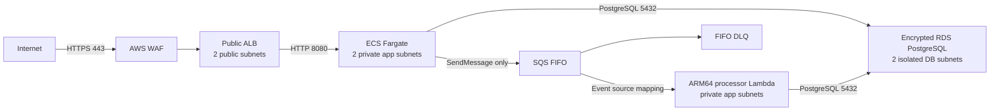

# Infrastructure

The repository has two intentionally separate Terraform roots:

- `infra/envs/local` is applied to LocalStack and proves the SQS-triggered Lambda loop.
- `infra/envs/aws` is a production-shaped, plan-tested AWS reference
  architecture. It is tested with a mocked provider and has not been deployed.

> **Never deployed:** This AWS reference architecture has never been applied to
> an AWS account. Do not run `terraform apply` for it casually: NAT Gateway,
> public IPv4, ALB, WAF, Fargate, RDS, Secrets Manager, CloudWatch, snapshots,
> SQS requests, and data transfer can all incur charges.

## AWS reference architecture



Security groups encode the same trust chain: public HTTPS can reach only the
ALB; ECS accepts traffic only from the ALB security group; RDS accepts
PostgreSQL only from the ECS and processor Lambda security groups. Neither ECS
tasks nor the Lambda receive public IPs.

The modules are deliberately composed in a flat tree:

| Module | Responsibility |
| --- | --- |
| `network` | Two-AZ VPC, public/app/database subnet tiers, routing and NAT |
| `public-api-edge` | HTTPS ALB, target group, WAF and AWS managed rules |
| `api-service` | Private Fargate service, logs, IAM and deployment controls |
| `processor-lambda` | ARM64 SQS consumer, environment configuration, logs, IAM and VPC access |
| `database` | Private encrypted RDS, managed credentials and deletion controls |
| `fill-queue` | FIFO queue, FIFO DLQ and redrive policies |

### Test evidence

The Terraform CI workflow does not use AWS credentials. Native Terraform test
files use a mocked AWS provider to check the planned resource graph:

| Assertion | Test location |
| --- | --- |
| Two availability zones and isolated subnet tiers | `modules/network/tests` |
| FIFO queue with explicit producer deduplication | `modules/fill-queue/tests` |
| RDS is private, encrypted and deletion-protected | `modules/database/tests` |
| HTTPS ALB and associated AWS-managed WAF rules | `modules/public-api-edge/tests` |
| Private ECS tasks and queue-scoped IAM | `modules/api-service/tests` |
| Private processor Lambda, required environment and queue-scoped IAM | `modules/processor-lambda/tests` |
| Internet → ALB → ECS/Lambda → RDS security-group boundaries | `envs/aws/tests` |

These tests validate Terraform configuration and architectural invariants. They
do not claim to verify AWS control-plane or runtime behaviour; that would
require an AWS deployment. LocalStack integration covers the real SQS event
source mapping and Lambda processor.

### Reference-environment cost and availability choices

| Resource | Reference choice | Cost and availability trade-off |
| --- | --- | --- |
| NAT Gateway | One, in the first AZ | Avoids a second hourly NAT charge, but loses zonal NAT resilience and can add cross-AZ data transfer when the task runs in the other AZ. Multiple interface endpoints are not automatically cheaper because each endpoint has per-AZ hourly and data-processing charges. |
| ECS Fargate | One task, 0.25 vCPU and 0.5 GiB | Smallest supported Fargate size and no autoscaling; there is no spare service capacity. |
| RDS PostgreSQL | `db.t4g.micro`, 20 GiB gp3, Single-AZ | Keeps compute and storage small; there is no synchronous standby or automatic Multi-AZ failover. |
| ALB and WAF | One of each, two standard AWS managed groups | Intentional recurring portfolio costs that demonstrate TLS ingress and managed web filtering. |
| CloudWatch | 30-day application logs plus Container Insights | Finite retention, but log ingestion/storage and Container Insights metrics remain chargeable. |
| Encryption | AWS-managed service keys | Avoids recurring customer-managed KMS key charges while retaining encryption at rest. |

No interface endpoints, bastions, EC2 instances, autoscaling policies, alarms,
dashboards, flow logs, custom KMS keys, or duplicate ECR repositories are created.

### Deliberate AWS teardown

If this reference is ever deployed, teardown is intentionally a two-step act.
First set the ALB and RDS `deletion_protection` arguments to `false` and remove
the RDS `prevent_destroy` lifecycle rule in a reviewed change. Then destroy the
root. Check for and deliberately remove the final RDS snapshot and RDS-managed
Secrets Manager secret when they are no longer needed; retained snapshots and
secrets can continue to incur storage or service charges. Finally confirm that
the NAT Elastic IP, NAT Gateway, ALB, WAF web ACL, log groups, and queues are gone.

## Local environment

The local environment runs Postgres and LocalStack from the root
`docker-compose.yml`. Terraform in `infra/envs/local` creates:

- `trade-ledger-fills.fifo`, with content-based deduplication disabled so the
  producer must use the fill ID as `MessageDeduplicationId`.
- `trade-ledger-fills-dlq.fifo`, with a redrive policy after three receives.
- the ARM64 .NET 10 processor Lambda and FIFO event source mapping with partial
  batch failure reporting.

The queue is defined in `infra/modules/fill-queue` so later AWS environments can
reuse the same queue semantics.

Postgres is available at `localhost:55432` (database/user/password:
`trade_ledger`). Override the host port with `TRADE_LEDGER_POSTGRES_PORT`; inside
the Compose network it remains `postgres:5432`.

## Start

From the repository root:

```bash
deploy/scripts/bootstrap-all.sh
```

This starts both containers, applies database migrations, packages the ARM64
Lambda, and initializes and applies Terraform.
Terraform state and Postgres data are local and ignored by Git/Docker.

Run the real ordering and idempotency integration test with:

```bash
TRADE_LEDGER_RUN_LOCALSTACK_INTEGRATION=1 dotnet test \
  tests/TradeLedger.IntegrationTests/TradeLedger.IntegrationTests.csproj \
  --filter FullyQualifiedName~LocalStackOrderingTests
```

## Stop

```bash
deploy/scripts/local-down.sh
```

To remove the Postgres data volume as well, run `docker compose down --volumes`.
